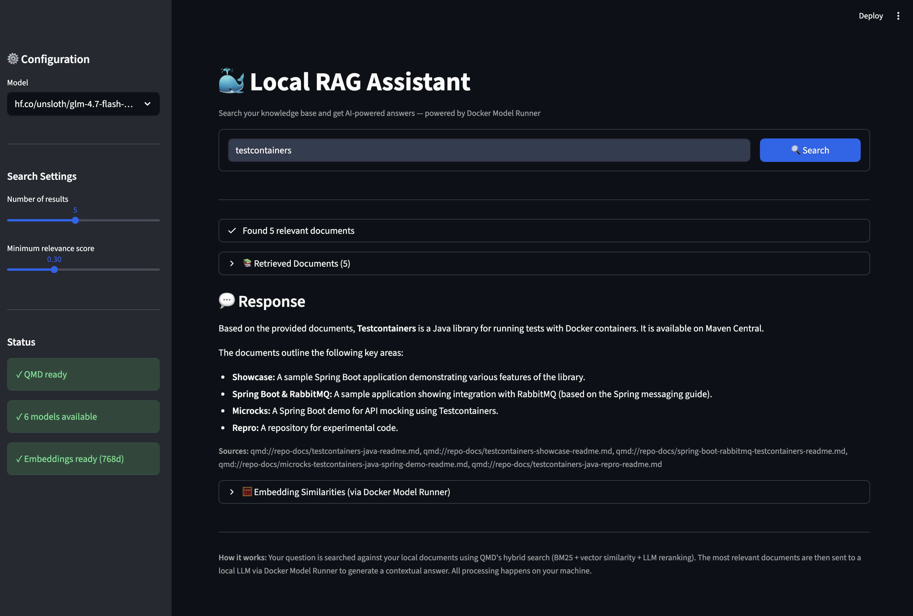

# QMD + Docker Model Runner Demo

A local RAG (Retrieval-Augmented Generation) app that combines:

- **[QMD](https://github.com/tobi/qmd)** - Hybrid markdown search (BM25 + vector + LLM reranking)
- **[Docker Model Runner](https://docs.docker.com/ai/model-runner/)** - Local LLM inference with OpenAI-compatible API

All processing happens on your machine. No data leaves your computer.




## Prerequisites

- [Docker Desktop](https://www.docker.com/products/docker-desktop/) with Model Runner enabled
- [Bun](https://bun.sh) (for QMD)
- [uv](https://docs.astral.sh/uv/) (recommended) or pip
- macOS with Homebrew SQLite (`brew install sqlite`)

## Setup

### 1. Install QMD

```bash
bun install -g https://github.com/tobi/qmd
```

### 2. Pull models with Docker Model Runner

```bash
# Check Docker Model Runner status
docker model status

# Pull a chat model
docker model pull hf.co/unsloth/glm-4.7-flash-gguf:Q5_K_XL

# Pull the embedding model (optional, for similarity display)
docker model pull ai/embeddinggemma
```

### 3. Index your documents with QMD

```bash
# Add collections
qmd collection add ~/Documents/notes --name notes
qmd collection add ~/work/docs --name docs

# Generate embeddings
qmd embed
```

### 4. Run the app

```bash
# Clone this repo
git clone https://github.com/shelajev/qmd-dmr-demo.git
cd qmd-dmr-demo

# Run with uv (recommended)
uv run streamlit run app.py

# Or with pip
pip install streamlit requests
streamlit run app.py
```

Open http://localhost:8501

## How it works

```
Your Question
     │
     ▼
┌─────────────┐     ┌─────────────┐     ┌─────────────┐
│    QMD      │────▶│   Context   │────▶│   Docker    │
│  (Search)   │     │  Assembly   │     │Model Runner │
└─────────────┘     └─────────────┘     └─────────────┘
     │                                        │
     ▼                                        ▼
 Your Docs                              Local LLM
 (Markdown)                              (GGUF)
                                             │
                                             ▼
                                         Answer
```

1. **Search**: QMD searches your indexed markdown files using hybrid search (BM25 + vector similarity + LLM reranking)
2. **Context**: Retrieved documents are assembled into context
3. **Generate**: Docker Model Runner sends the context to a local LLM for answer generation
4. **Stream**: Response streams back to the UI in real-time

## Features

- 🔍 **Hybrid search** - Combines keyword and semantic search with LLM reranking
- 🐳 **Docker Model Runner** - Easy local LLM management
- 🔒 **Fully local** - No data leaves your machine
- ⚡ **Streaming responses** - See answers as they generate
- 📊 **Embedding similarities** - Optional cosine similarity display using DMR's embedding API

## Configuration

Edit the constants in `app.py`:

```python
DMR_API_URL = "http://localhost:12434/engines/llama.cpp/v1"
DEFAULT_MODEL = "hf.co/unsloth/glm-4.7-flash-gguf:Q5_K_XL"
EMBEDDING_MODEL = "ai/embeddinggemma"
```

## Links

- [QMD](https://github.com/tobi/qmd) - Quick Markdown Search by Tobi Lütke
- [Docker Model Runner](https://docs.docker.com/ai/model-runner/) - Docker's local AI model runner
- [GGUF Models on HuggingFace](https://huggingface.co/models?library=gguf)
